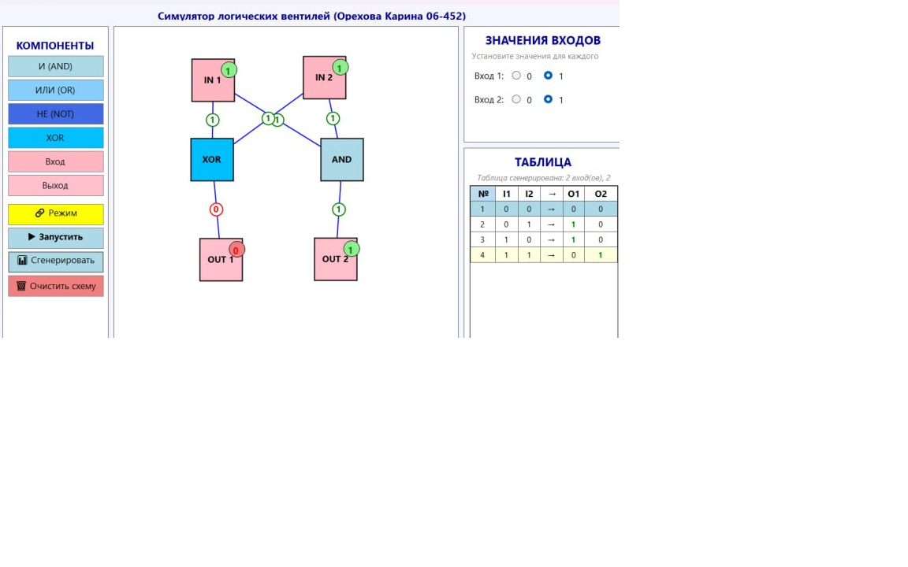

# 🎮 Logic Gates Simulator (C# / Windows Forms)

Простой симулятор логических схем на C# с графическим интерфейсом Windows Forms.

## 📸 Скриншот

## ✨ Возможности
- Визуальное проектирование схем
- Логические элементы: AND, OR, NOT, XOR
- Режим реального времени
- Генерация таблиц истинности
- Перетаскивание элементов

## 🚀 Запуск
1. Откройте LogicGatesSimulator.sln в Visual Studio 2022
2. Нажмите **F5** для запуска

## 👩‍💻 Автор
**Ореха Каринова**  
GitHub: [@oreshkarian](https://github.com/oreshkarian)

